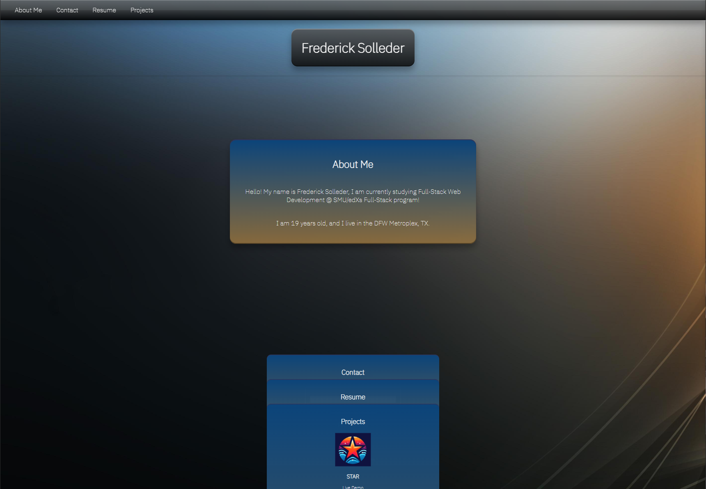
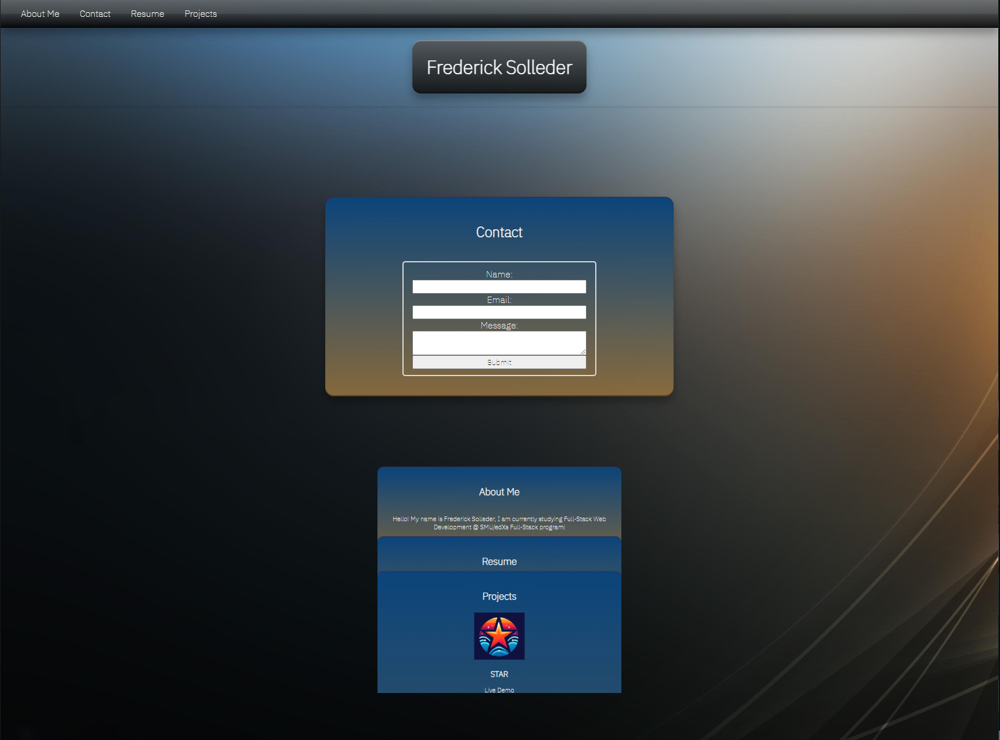

# react-portfolio

## Description

This is my personal protfolio, now made with React! I originally wanted to utilize an older style of webpage called Frutiger Aero in my design elements, however I switches paths halfway through to attempt to emulate the old Xbox 360 "Blades" UI. However, it became pretty evident that the Blades UI is not made for mouse/keyboard/smartphone users, and is really only meant for console use. So, I took what was left and made the current stacked folder UI.

## Installation

You can view my portfolio through (most) modern browsers, mobile support will be coming down the pipeline soon.

## Usage 

Upon opening the Netlify Link: https://main--delightful-faun-2219e8.netlify.app/

You should be greeted to this page:

Both clicking on a tab or clicking the associated tab in the navbar will bring up the card with the associated information:

## Credits

NavBar(s): https://frutiger-aero.neocities.org/ 
Netlify Documentation: https://docs.netlify.com/
Various Stack Overflow Forums: https://stackoverflow.com/